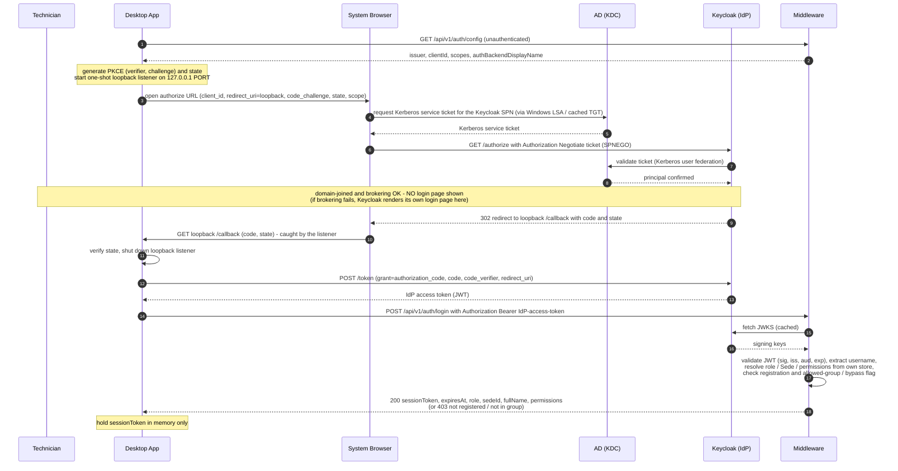
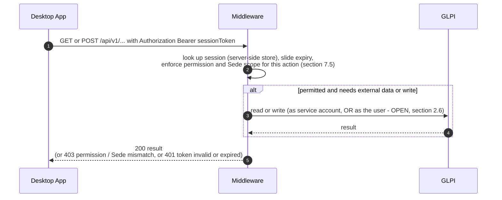
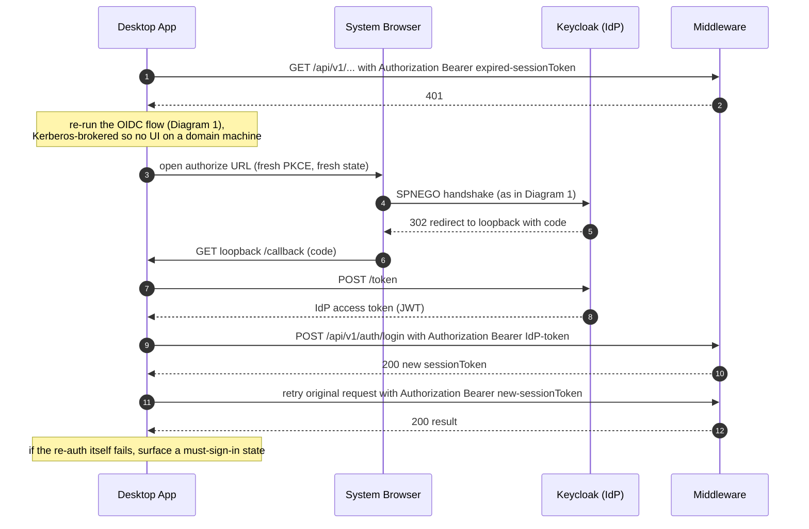

# Auth Flow — Generador de Notas IT Middleware

Status: **DRAFT** — companion to `backend-contract.md` §2 / §7.
Branch: `backend-api-middleware-contract` (off `backend-api`).
Last updated: 2026-08-31.

Communication-flow view of the authentication design settled in
`backend-contract.md` §2: **OIDC Authorization Code + PKCE against Keycloak,
Kerberos-brokered**, for a 100% domain-joined Windows fleet. The desktop app
never handles a password. Keycloak is the concrete IdP today; per the
contract's §1 nothing is named after it.

Key point: **the middleware validates Keycloak's token itself (via JWKS) and
never involves GLPI in login.** GLPI is entered only afterward, by the
middleware, on business calls (Diagram 2).

---

## Who owns what

| Actor | Responsibility in the auth flow |
|-------|--------------------------------|
| **Technician** (human) | Nothing on a domain-joined machine — login is silent. Types credentials *only* if Keycloak has to fall back to its own login page. |
| **Desktop App** | Orchestrates the OIDC dance: generates PKCE, runs the one-shot loopback listener, opens the browser, does the `code`→token exchange with Keycloak, swaps the IdP token for a middleware `sessionToken`, holds it **in memory only**, re-runs the flow silently on `401`. Never sees a password. Never talks to GLPI or AD directly. |
| **System Browser** | Carries the SPNEGO handshake with Keycloak and follows the redirect back to the app's loopback listener. The only component that touches the Windows Kerberos session. |
| **AD / KDC** | Issues the Kerberos service ticket (via the Windows LSA cache, from the TGT obtained at Windows logon). Keycloak validates tickets against it (Kerberos user federation). |
| **Keycloak (IdP)** | Authenticates the user — SPNEGO, or its own login page as fallback. Issues the OIDC `code`, then the access token (JWT). Owns login-attempt throttling (replaces today's `countRecentFailedLoginAttempts`). |
| **Middleware** | Validates the IdP JWT (signature via JWKS, `iss` / `aud` / `exp`), resolves role / Sede / permissions from its own store, enforces the registration + allowed-group gate, mints and stores the opaque `sessionToken`. Enforces RBAC + Sede-scoping server-side on every later call (§7.5). Custodian of all GLPI / AD / SMTP secrets. |
| **GLPI** | **Not in login at all.** Entered only by the middleware on business calls afterward — as a service account, or as the real user (open item, `backend-contract.md` §2.6). |

---

## 1 — Initial login (cold start, or after session expiry)

---

## 2 — Authenticated request (steady state)

---

## 3 — Silent re-auth on `401`

---

## Notes

- **`GET /api/v1/auth/config`** (Diagram 1, step 1) is unauthenticated, so
  the app ships configured with only `middleware.baseUrl` and discovers the
  Keycloak coordinates at runtime.
- **The loopback listener** is RFC 8252 (OAuth 2.0 for Native Apps): the app
  binds `127.0.0.1:<random>`, uses it as the `redirect_uri`, and shuts it
  down once the `code` arrives. System browser, not an embedded webview.
- **`state`** guards against a stray/forged callback; **PKCE** (`code_verifier`
  / `code_challenge`) makes the public client safe without a client secret.
- **Session token** (`backend-contract.md` §2.4): opaque, server-side store,
  sliding ~2h idle / ~12h absolute cap, in-memory only on the client, no
  app-held refresh token — Diagram 3 is the "refresh."
- **Login-attempt throttling** is Keycloak's now — `/auth/login` never sees a
  password and can't be brute-forced.
- **Open item** (`backend-contract.md` §2.6 / companion `new-middleware-app.txt`
  §10.9): in Diagram 2's `MW->>GLPI` hop, does the middleware act as the real
  technician's own GLPI account (needs every technician in GLPI + a
  token-exchange / impersonation path from Keycloak) or as one shared GLPI
  service account with the real actor recorded only in the middleware's own
  audit? Does not affect the app-facing contract.
