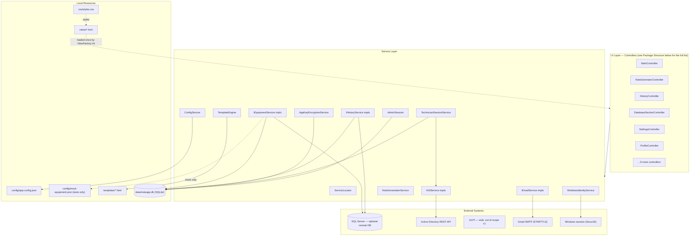
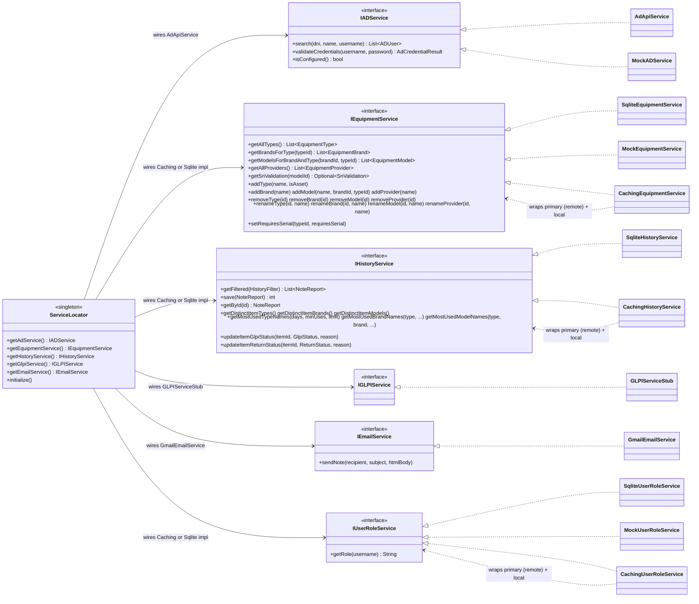
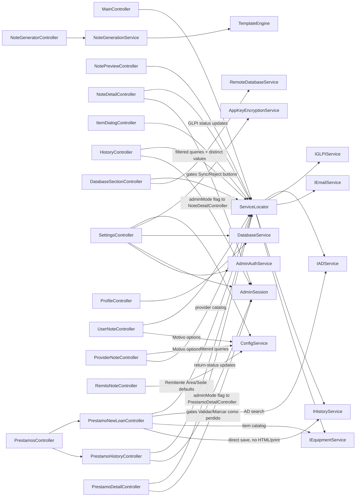

# Architecture

## Overview

**Generador de Notas IT** is a JavaFX desktop application for IT support teams at Universidad Siglo 21. It generates equipment handover notes (Notas IT) and maintains a local history of all generated reports.

The application follows a layered MVC architecture with a service abstraction layer that allows external dependencies (AD, GLPI, database) to be swapped without touching UI code.

---

## System Architecture (whole-app overview)

The most detailed, literal version of "every class connected to every other class" isn't this diagram — it's the actual dependency graph, which you can regenerate any time with `jdeps` (bundled with the JDK):

```bash
cd desktop-app
mvn -q compile
jdeps -verbose:class -filter:package target/classes > jdeps-output.txt
# or, for a rendered graph (requires Graphviz's `dot` on PATH):
jdeps -verbose:class -dotoutput target/jdeps-dot target/classes
dot -Tsvg target/jdeps-dot/note_app_for_it_frontend.dot -o class-graph.svg
```

That's exhaustive and always accurate, but Java-only — it can't see FXML/HTML/config file references (those are runtime string paths, not compile-time dependencies) or external systems. The diagram below is the hand-curated complement: grouped by layer, with the non-code connections `jdeps` can't find drawn in explicitly.



**Reading this diagram**: every arrow crossing a subgraph boundary is real — a controller calling `ServiceLocator`, a service reading/writing a file or making a network call. Arrows *within* the UI and Service subgraphs are intentionally omitted here (that's what the [Service Dependency Map](#service-dependency-map) and the [service class diagram](#service-abstraction-strategy-pattern) are for) — this diagram's job is the big picture: which layer talks to which external thing, not which specific controller calls which specific method.

---

## Package Structure

```
desktop-app/src/main/java/com/bunshock/note_app_for_it_frontend/
├── App.java                          — JavaFX entry point; wires up config, DB, services
├── Launcher.java                     — Alternate main with Kerberos VM args (IDE use)
├── controllers/
│   ├── MainController.java           — Root layout: sidebar nav, status polling, AD startup lookup
│   ├── NoteGeneratorController.java  — Equipment tables, note profile switching, generate trigger
│   ├── UserNoteController.java       — User note fields: type toggle, Motivo, AD search
│   ├── ProviderNoteController.java   — Provider note fields: name, CUIT, Motivo, responsible
│   ├── RemitoNoteController.java     — Remito de Envío fields: Destinatario (free text) and Remitente (coordinator name, manual; Área/Sede editable, defaulted from config)
│   ├── ItemDialogController.java     — Add/edit item: cascading dropdowns, S/N, A/F, quantity
│   ├── NotePreviewController.java    — Preview popup: rendered HTML, print/email options
│   ├── NoteDetailController.java     — History detail popup: HTML preview + item list with admin GLPI actions
│   ├── HistoryController.java        — History table with multi-select filters and CSV/xlsx export
│   ├── DatabaseSectionController.java — Equipment catalog CRUD, DB IP config
│   ├── SettingsController.java       — A/F format, SMTP, GLPI URL, S/N validation table, admin toggle
│   ├── ProfileController.java        — Technician personal profile (read from DB)
│   ├── AboutController.java          — App info
│   ├── ADUserSelectionController.java — Multi-result AD user picker dialog
│   ├── ItemDialogHost.java            — Interface: callback for the item-add popup (implemented by NoteGeneratorController, PrestamoNewLoanController)
│   ├── AdSearchHost.java              — Interface: callback for the AD search popup (implemented by UserNoteController, PrestamoNewLoanController)
│   ├── PrestamosController.java       — Préstamos section shell: Cargar Nuevo Préstamo / Historial de Préstamos toggle
│   ├── PrestamoNewLoanController.java — Non-printing direct-entry Préstamo form (own item tables + AD search)
│   ├── PrestamoHistoryController.java — Préstamo-scoped history table: return-status coloring + overdue indicator
│   └── PrestamoDetailController.java  — Préstamo detail popup: per-item return status with admin validate/reject actions
├── models/
│   ├── ADUser.java                   — AD lookup result
│   ├── AppConfig.java                — Deserialized app-config.json structure
│   ├── AssetItem.java                — Equipment item with S/N and A/F (JavaFX properties)
│   ├── CountableItem.java            — Equipment item with quantity (JavaFX properties)
│   ├── EquipmentBrand.java           — Brand entity
│   ├── EquipmentModel.java           — Model entity (belongs to a BRAND_TYPE_LINK)
│   ├── EquipmentProvider.java        — Provider entity (flat, no type/brand/model structure)
│   ├── EquipmentType.java            — Type entity with isAsset flag
│   ├── EquipmentItem.java            — Base class for AssetItem and CountableItem
│   ├── GlpiStatus.java               — Enum: N_A, PENDING, SYNCED, REJECTED
│   ├── ReturnStatus.java             — Enum: N_A, PENDING, RETURNED, LOST (Préstamo return tracking)
│   ├── HistoryFilter.java            — Filter params for history queries (dates, multi-select lists)
│   ├── NoteReport.java               — Saved note report (history entry) with aggregated GLPI + return-status counts and areaEvento
│   ├── NoteReportItem.java           — Individual item row in a saved report with GlpiStatus and ReturnStatus
│   ├── SnValidation.java             — S/N regex rule for a specific model
│   └── SnValidationRow.java          — Display row for S/N validation admin table
├── services/
│   ├── AdminAuthService.java         — Admin password verification (SHA-256 hash stored in APP_SETTINGS)
│   ├── AdminSession.java             — Singleton: tracks active admin session; fires activate/deactivate listeners
│   ├── ConfigService.java            — Singleton: loads/saves app-config.json
│   ├── DatabaseService.java          — SQLite connection pool and schema initialization
│   ├── RemoteDatabaseService.java    — SQL Server connection and DDL; used by Caching* wrappers
│   ├── ServiceLocator.java           — Single wiring point for all service implementations
│   ├── IADService.java               — AD lookup interface (search + isConfigured)
│   ├── AdApiService.java             — Active implementation: REST client for the AD API (see below)
│   ├── MockADService.java            — In-memory AD mock (tests only)
│   ├── IEquipmentService.java        — Equipment catalog interface (types, brands, models)
│   ├── MockEquipmentService.java     — JSON-backed equipment catalog (reads mock-equipment.json)
│   ├── SqliteEquipmentService.java   — SQLite-backed equipment catalog
│   ├── CachingEquipmentService.java  — Remote-first wrapper: tries SQL Server, falls back to SQLite
│   ├── IHistoryService.java          — Note history persistence interface + distinct-value query methods
│   ├── SqliteHistoryService.java     — SQLite-backed history: filtered queries, GLPI status updates, distinct catalog values
│   ├── CachingHistoryService.java    — Remote-first wrapper: tries SQL Server, falls back to SQLite
│   ├── IGLPIService.java             — GLPI API interface
│   ├── GLPIServiceStub.java          — No-op stub (GLPI out of scope for v1)
│   ├── IEmailService.java            — Email sending interface
│   ├── GmailEmailService.java        — Jakarta Mail + Gmail SMTP implementation
│   ├── AppKeyEncryptionService.java  — Credential encryption via AES-256/GCM (fixed shared key)
│   ├── TemplateEngine.java           — {{TOKEN}} and {{#LOOP}} HTML template renderer
│   └── NoteGenerationService.java    — Builds rendered HTML notes from form data + templates
└── utils/
    ├── AdminPasswordHashGenerator.java   — CLI utility to generate admin password SHA-256 hash
    ├── AppKeyEncryptionGenerator.java    — CLI utility to pre-encrypt default secrets for app-config.json
    └── ViewFactory.java              — View cache: loads each FXML once, reuses across nav switches
```

---

## Key Patterns

### Service Abstraction (Strategy Pattern)
Every external dependency has an interface (`IADService`, `IEquipmentService`, `IGLPIService`, `IEmailService`, `IHistoryService`, `IUserRoleService`). Concrete implementations are wired in `ServiceLocator.initialize()`. Swapping from mock to real is a one-line change in `ServiceLocator`.



### Login screen (LoginController) and IUserRoleService

Added 2026-07-24. `App.java` shows a small login `Scene` (`LoginController` + `views/LoginView.fxml`) before `MainView` is built at all — a successful login is what triggers `App.showMainApp(Stage)`, the entire previous `start()` body. `LoginController.handleLogin()`: `IADService.validateCredentials(username, password)` → AD group-membership check (`AppConfig.adAccess.allowedGroupName`, blank = skipped) → `search(null, null, username)` profile lookup → `IUserRoleService.getRole(username)` → `TechnicianSessionService.loginResolved(ADUser, role)`, activating `AdminSession` permanently (no 15-minute expiry) for an `ADMIN` role. `IUserRoleService` is intentionally **read-only** — just `getRole(username)` — following the same remote-first/local-fallback `CachingXxxService` shape as `IEquipmentService`, backed by a flat `USER_ROLE(username, role)` table. **No in-app UI edits this table**: a first version added a 6th catalog list ("Usuarios") to Base de Datos for this, removed the same day per explicit user preference for direct SQL over an in-app CRUD screen for something this infrequent.

### Active Directory Integration (AdApiService)
`AdApiService` (singleton, `configure(baseUrl, apiToken)` / `isConfigured()`) is the active `IADService` implementation, calling `<baseUrl>/api/v1/ad/users` with `dni`/`name`/`username` query params (server-side ANDs whatever is supplied) and an `Authorization: Bearer <token>` header. `MockADService` is test-only now — `ServiceLocator` always wires `AdApiService`.

`validateCredentials(username, password)` (added 2026-07-24 for the login screen) `POST`s to `<baseUrl>/api/v1/ad/validate-credentials` — same Bearer token, body `{username, password}` — and expects `{"valid": bool, "groups": [...]}`. **This endpoint doesn't exist on the real AD API yet**; `MockADService`'s stub (fixed password, mock group) is what the login flow was built and tested against in the meantime.

**Temporary production bypass** (`AppConfig.adAccess.mockCredentialValidation`, default `false`): when `true`, `AdApiService.mockValidateCredentials()` skips the HTTP call above entirely, accepting any password but still confirming the username via the real, already-working `search()` lookup, and still populating the configured `allowedGroupName` in its returned groups so the access gate stays consistent. Logs an unmissable `[MOCK]` line on every use. Exists solely because the real AD API can't be extended yet; set back to `false` once it can.

- **Config storage**: the URL (`adApi.baseUrl`) lives in `app-config.json` like `glpiApi.baseUrl`; the token is a secret, encrypted (`AppKeyEncryptionService`) into `APP_SETTINGS` (`ad_api_token`), never re-displayed once saved (write-only `PasswordField`, same pattern as `glpi_api_key`). Both fields live in `SettingsController`'s "ACTIVE DIRECTORY API" card, admin-gated like every other config field. Can ship pre-configured via `app-config.json`'s `defaults.adApiToken` — see "Credential Encryption" pattern below.
- **Verify-before-save**: saving a new URL/token in Settings tests the connection on a background thread (using the current technician's already-resolved username as a cheap, real query) before persisting; a failed test prompts for confirmation rather than silently accepting bad config — mirrors `DatabaseSectionController`'s DB connection flow.
- **DNI query variants**: a technician-typed DNI (digits only) is queried in its plain form plus a dotted variant (grouped by 3 from the right of whatever's typed so far, e.g. `45933368` → `45.933.368`); results are merged and deduped by `samAccountName`.
- **Partial DNI search against a dotted-stored record is a known, accepted AD limitation, not something this app can fix** (investigated 2026-07-10): some AD accounts have their `dni` stored plain (e.g. `40858705`), others dotted (e.g. `40.858.711`) — inconsistent data entry, not something under this app's control. A full 7/8-digit query reliably matches either form (both `dniVariants()` guesses get tried). But a *partial* prefix search against a dotted-stored record only succeeds when the typed length happens to coincide with a dot boundary — confirmed by testing multiple dotted query variants directly against the real API (bypassing this app), including one that was a character-for-character exact prefix of the stored value and *still* didn't match. The technician also reproduced the identical failure in the native Windows AD search tool, confirming this is how the record is indexed in Active Directory itself, not an API quirk or a client query-shape problem. Do not attempt to "fix" this with cleverer dot-insertion — it was tried and empirically disproven; see `AdApiService.dniVariants()`'s doc comment for the full investigation trail.
- **Name query variants**: `name` is a partial/contains (substring) match against the stored `"Apellido, Nombre(s)"` display format, so a typed name is queried as multiple guesses, merged: `preciseNameVariants()` always tries the text as-typed plus two comma-inserted reorderings — `"<lastWord>, <restOfWords>"` (matches "Nombre Apellido" input) and `"<firstWord>, <restOfWords>"` (matches "Apellido Nombre" input, i.e. the stored order but missing its comma) — since the input alone doesn't say which end holds the surname. **Cascading fallback for incomplete words** (2026-07-10): a substring match can only succeed if every word of the query is either complete or is the very last word of the query string — an incomplete word anywhere else breaks the match (e.g. reordering "Joaquin Rodrig" guesses `"rodrig, joaquin"`, but that's not a substring of the stored `"rodriguez, joaquin"` since `"rodrig"` isn't immediately followed by `", joaquin"`). When the precise guesses return zero results, `search()` automatically fires a second round via `wordFallbackVariants()` — each word of the input queried alone — since a lone word only needs to be a prefix of one stored word, not exactly followed by the rest of the target string. This second round only runs on a zero-result first round, so a well-formed complete name still resolves in one round-trip.
- **Every supplied field is re-verified client-side, unconditionally — the server cannot be trusted to AND dni/name/username, full stop** (fixed 2026-07-10, then corrected further the same day). First report: searching by name got the right match, then *adding* a dni to that same search returned different people who only matched the dni, never the name. The first fix only re-verified dni/username, still trusting the server's name matching — insufficient, because the *precise* round (not just the word-fallback round) turned out to not reliably AND name with dni either: a two-result name-only search followed by adding an incomplete dni returned two entirely different, dni-only matches. **Root cause is the merge-then-trust-the-union pattern itself**: `search()` fires several query variants (different dni/name phrasings) and unions whatever comes back, and nothing verified that a unioned-in candidate actually satisfied every field the technician typed — not just the one field that particular query variant happened to search by. The fix: after gathering candidates from either round, `search()` runs one final, unconditional pass — `matchesAllWords()` (displayName contains every typed name word, pre-`normalizeName()` raw string so the comma-stripping doesn't affect it), `matchesDni()` (own `dto.dni`, dots stripped from both sides, starts with the typed digits — unaffected by the dotted-storage limitation above), `matchesUsername()` (own `samAccountName` matches, same separator-agnostic check `MockADService` uses) — and drops any candidate failing a field that was actually supplied. **No escape hatch**: the old word-fallback round had a "fall back to the broader unfiltered union if the strict filter empties everything" safety net; this final check has none, deliberately — if dni/name/username don't all match simultaneously, an empty result is correct, not a bug to route around.
- **Error handling**: any non-200 response (401 `invalid_api_key`/`missing_api_key`, 5xx, network failure) throws, so existing callers (e.g. `TechnicianSessionService`) can keep distinguishing "AD reachable, zero matches" from "AD unreachable" without change. A `200` with an empty array is a normal zero-match result.
- **Any DTO field can be a JSON array**: discovered 2026-07-08 via two real crashes (`MismatchedInputException`) on the same broad search — first on `dni`, then (after fixing that one field) again on `mail` for the same account. Confirmed this isn't a one-field quirk: every field on `AdApiUserDto` (`samAccountName`, `displayName`, `dni`, `mail`, `ou`) is typed `JsonNode`, not `String`, and normalized via `extractString()`: plain string → as-is, array → first element (or `""` if empty), `null`/missing → `null`. If a crash on this DTO ever recurs, it's almost certainly a new field needing the same treatment, not a one-off.
- **`dni`/`displayName` are normalized at the same `toADUser()` boundary** (2026-07-10 fix): the real AD API returns `dni` with thousands-separator dots (`"00.000.000"`) and `displayName` as `"Apellido, Nombre"`. Every destination `TextField` for these values (`UserNoteController.txtUserDni`/`txtUserName`, `ProfileController.txtProfileDni`/`txtProfileName`) has a `TextFormatter` restricting input to digits-only or letters-and-spaces — and `TextFormatter` filters programmatic `setText()` calls exactly like typed input, so an un-normalized value is silently rejected instead of shown (the field is left blank). `AdApiService.normalizeDni()` strips non-digit characters; `normalizeName()` strips the comma and collapses whitespace, keeping AD's `"Apellido Nombre"` word order as-is (no reordering to "Nombre Apellido"). `MockADService`'s fixture data was already in the clean format, which is why this went unnoticed until tested against the real API's raw shape.
- **Reachability check**: `MainController`'s periodic 60s AD status poll queries by the current technician's own already-resolved username (`TechnicianSessionService.getUsername()`) instead of an unbounded/empty query, to avoid pulling the full directory just to check liveness; the sidebar dot shows a third gray "No configurado" state via `IADService.isConfigured()` when the URL/token aren't set, distinct from red "Desconectado".
- **`ADUser` no longer carries group memberships** — the real API's DTO has no such field. It now carries the raw `ou` string (e.g. `OU=2025,OU=Bajas,OU=Cau2018,OU=SEDES CAU`) in the existing `distinguishedName` field, shown as-is in `ADUserSelectionController`'s multi-result popup; the "GRUPOS" line was removed.

### Technician Display Name Preference (TechnicianSessionService)
`TechnicianSessionService` is otherwise fully session-only (see its class doc comment), but `getDisplayName()`/`setDisplayNamePreference()` are the one deliberate exception, added 2026-07-10 to fix the sidebar welcome greeting.

- **The bug**: the greeting used to grab the *first* word of the technician's AD full name, assuming "Nombre Apellido" order. Since `AdApiService.normalizeName()` keeps AD's actual "Apellido Nombre" order, that logic was silently greeting technicians by their surname instead of their given name.
- **The fix**: `getDisplayName()` returns the technician's own explicit preference if set, else falls back to `defaultDisplayName()` — the *last* word of the full name (correct now that the order is "Apellido Nombre"), capitalized.
- **Persistence**: unlike Name/Username/Email/DNI, the preference is a personal cosmetic choice independent of AD identity, so it's persisted in `APP_SETTINGS` keyed by `"display_name_pref:" + username` (local SQLite only, same as `ad_api_token`/`db_host` — not mirrored to the remote database). This keeps it correctly scoped per technician even if multiple people share one installed app on a shared machine, and lets it survive both app restarts and AD refreshes (`refreshFromWindowsSession()`/`applyManualOverride()` both reload it from disk after updating identity, rather than clearing it).
- **UI**: `ProfileController`'s "NOMBRE PARA MOSTRAR" field (`ProfileView.fxml`) is deliberately *not* gated by `AdminSession` like the other four profile fields — it's always editable, with its own always-visible "Guardar" button (`handleSaveDisplayName()`). It's pre-filled with `getDisplayName()`'s current effective value (preference or suggested default), so a technician who never touches it just sees — and can tweak — the suggested default. Saving a blank value clears the preference back to the suggested default rather than storing an empty override.

### Technician Sede Preference (TechnicianSessionService)
Added 2026-07-22, a second exception to `TechnicianSessionService`'s otherwise session-only identity data, same shape as the display-name preference above but a fully independent concept — a technician's Sede has no AD-sourced field to derive a default from, unlike the display name's "last word of full name" fallback.

- **Storage**: `getSede()`/`setSedePreference()`, persisted in `APP_SETTINGS` keyed by `"sede_pref:" + username` (local SQLite only). Its own listener list (`addOnSedeChangeListener`) keeps a Sede save from re-triggering the AD-identity or display-name status messages, same reasoning as the existing listener split between those two.
- **UI**: `SettingsController`'s "SEDE" field (`SettingsView.fxml`) — placed in Configuración per explicit user request, not Mi Perfil, even though the value is per-technician like the display name. Not admin-gated: always editable, with its own "Guardar" button (`handleSaveSede()`), unlike every other field in that panel.
- **Mandatory to generate a note**: `NoteGeneratorController.handleGenerateNote()` and `PrestamoNewLoanController.handleGuardarPrestamo()` both block (same pattern as the existing AD-profile-incomplete check) if `getSede()` is blank, showing a dedicated warning directing the technician to Configuración.
- **Snapshotted onto every note, printed on every template**: `NOTE_REPORT.sede` stores the value at generation time (same "snapshot, don't reference" pattern as `technician_name`/`technician_dni`/`observations`), rendered via a `{{SEDE}}` token. On 5 of the 6 templates (`entrega.html`, `devolucion.html`, `entrega - fin de contrato.html`, `proveedor.html`, `prestamo.html`) it replaces a previously hardcoded "Campus" in the intro sentence ("En la sede {{SEDE}} de la Universidad Siglo 21..."); `remito.html` (which has no such sentence) prints it as a "Sede: {{SEDE}}" line in the header. This is independent of `NOTE_REMITO`'s own `destinatario_sede`/`remitente_sede` fields, which keep their existing, unrelated meaning.

### ViewFactory — State Persistence Across Navigation
`ViewFactory` loads each section FXML exactly once and caches the result. When `MainController` switches sections via sidebar, it calls `viewFactory.getXxxView()` which returns the cached node. Controller instances — and their bound data — remain alive in memory for the session. This implements FR-08 (in-session data persistence).

### Template Engine
`TemplateEngine.render()` processes HTML templates using:
- `{{TOKEN}}` → replaced with a value from the token map
- `{{#LOOP_KEY}}...{{/LOOP_KEY}}` → expanded once per item in the items list, each item having its own token map

Templates live in `src/main/resources/.../templates/`. `NoteGenerationService` selects the correct template based on note profile type and builds the token maps from form data.

### Credential Encryption (AppKeyEncryptionService)
`AppKeyEncryptionService` (AES-256/GCM, `javax.crypto`) encrypts/decrypts five shared organizational secrets — `smtp_password`, `glpi_api_key`, `db_username`, `db_password`, `ad_api_token` — stored as Base64 in the `APP_SETTINGS` SQLite table. Replaced `WindowsDPAPIService` on 2026-07-08: DPAPI ties every encrypted value to the specific Windows account that encrypted it, which made pre-configuring these fleet-wide shared credentials across many technician machines impractical without visiting each one (none of these are actually *personal* per-technician secrets — they're all IT-department-owned service credentials identical across every installation). `AppKeyEncryptionService` uses one fixed key embedded in the app, shared across every installation.

**Explicit accepted trade-off** (discussed with and decided by the user, not a default/oversight): this is materially weaker than DPAPI against a determined local attacker — the key can be extracted from the installed app by decompiling it, and the same key decrypts every installation's secrets, not just one machine's. It stops casual plaintext exposure (opening `noteapp.db` in a browser/viewer) but not a deliberate extraction attempt. If a proper installer is built later, generate a unique key per deployment at packaging time instead of reusing one static key indefinitely (tracked as a known follow-up).

**Zero-touch pre-configuration**: `app-config.json`'s `defaults` object (`smtpPassword`, `glpiApiKey`, `dbUsername`, `dbPassword`, `adApiToken`) holds pre-encrypted values, generated via `utils.AppKeyEncryptionGenerator` (mirrors `AdminPasswordHashGenerator`'s existing CLI pattern). `ServiceLocator.provisionDefaultSecrets()` copies any of these into `APP_SETTINGS` on first startup, only for keys not already set — an admin's later edit via Settings/Base de Datos always takes precedence and is never overwritten by a shipped default. `dbUsername` was added 2026-07-13 alongside `remoteDatabase` below — before that there was no `defaults` field for it at all.

**Pre-configuring a remote database before first startup** (added 2026-07-13): `app-config.json`'s top-level `remoteDatabase` object (`host`, `port` default `1433`, `dbName`) holds the **non-secret** connection fields — these are plaintext, matching how `db_host`/`db_port`/`db_name` are already stored unencrypted in `APP_SETTINGS`. `ServiceLocator.provisionDefaultSecrets()` copies them in the same one-shot, never-overwrite way as `defaults`, but only when `remoteDatabase.host` is non-blank (an empty host means "not configured," so port/dbName are skipped too rather than leaving a half-populated, host-less connection). Combined with `defaults.dbUsername`/`dbPassword`, this lets an installer ship with a shared remote SQL Server fully wired up — no admin has to open Base de Datos → Editar at all on a fresh machine. This replaced the old `database.baseUrl` field (`AppConfig.database`, an `ApiEndpoint` like `adApi`/`glpiApi`) that was declared but **never actually read anywhere in the code** — a dead leftover from before `RemoteDatabaseService`'s JDBC host/port/dbName/username/password connection model existed, confirmed unused by a full-codebase grep before removal.

### SQLite Local Database
`DatabaseService` initializes a local `data/noteapp.db` on first run. The schema mirrors the remote SQL Server structure closely (same table names, column types differing only where the dialect requires it — see `RemoteDatabaseService.ensureSchema()`). The `Generic` brand is inserted as protected default data on initialization.

### Admin Mode (AdminSession)
`AdminSession` is a singleton that tracks whether an admin session is currently active. Controllers register listeners via `addOnActivateListener` / `addOnDeactivateListener`. Activation is done via `SettingsController.handleToggleAdmin()` which calls `requireAdmin(Runnable)` — this checks if a password is configured (`AdminAuthService.isConfigured()`), prompts for it, verifies against the stored SHA-256 hash, then fires the callback. Sessions auto-expire after 15 minutes of inactivity. `SettingsController`'s own configuration fields (A/F format, SMTP, GLPI API) and its "Guardar Configuración" button are disabled unless admin mode is active, via the same listener pair (`SettingsController.updateFieldEditability()`).

### Note Detail Popup (admin-integrated GLPI actions)
`NoteDetailController.open(NoteReport, boolean adminMode, Window owner, Runnable onUpdate)` opens a floating stage showing the rendered HTML note alongside a scrollable item card list. When `adminMode` is true and `AdminSession.getInstance().isActive()`, each PENDING item's card includes Sync and Reject buttons. The `adminMode` flag is set from the caller by reading `AdminSession.getInstance().isActive()` at open time. No separate admin tab or view — actions are embedded directly in the popup.

### History Filtering
`HistoryController` uses `MenuButton` with `CustomMenuItem(CheckBox, false)` to build non-closing multi-select dropdowns for note type, GLPI status, and equipment type/brand/model. Equipment dropdowns cascade: tipo → refreshBrandMenu() → refreshModelMenu() each time a selection changes. Distinct values for type/brand/model are read from `NOTE_ITEM` historical data (not the current catalog) via `IHistoryService.getDistinctItemTypes/Brands/Models()`. Filter state is assembled into a `HistoryFilter` and passed to `IHistoryService.getFiltered()`. **Autor filter** (added 2026-07-10): a free-text field alongside the recipient search, matching `COALESCE(r.technician_name, tp.name)` — repeated inline in `SqliteHistoryService.getFiltered()`'s WHERE clause rather than referencing the `author_name` SELECT alias, since SQL Server doesn't allow referencing a SELECT alias in WHERE (SQLite tolerates it, but this query runs against both — see `ServiceLocator`'s dual wiring of `SqliteHistoryService` for local vs. remote).

**Refresh on section open** (fixed 2026-07-10): `ViewFactory` caches every section's controller for the session (see below), so `HistoryController.initialize()`'s one-time `loadGlobal()` call meant a note generated after the technician's first visit to Historial never appeared until they manually clicked "Buscar". `MainController.handleShowHistory()` now calls the newly-exposed `viewFactory.getHistoryController().refresh()` on every navigation to History, which re-runs `loadGlobal(buildFilter())` — reusing whatever filters are currently set rather than resetting them. `ProviderNoteController.refreshProviders()` (see below) is the same fix applied to the provider-catalog dropdown.

### Provider Catalog (EquipmentProvider)
`PROVIDER` (flat: `id`, `name UNIQUE`, `deprecated` — no type/brand/model structure, unlike the equipment catalog) backs `ProviderNoteController`'s "PROVEEDOR" `ComboBox`. **Fixed 2026-07-10**: this field used to be entirely non-functional — a `ComboBox<String>` never populated with items and never made editable anywhere in the code, so `getProviderName()` always returned `""` and every provider note generated through the live UI silently saved with a blank provider name. `IEquipmentService` gained `getAllProviders()`/`addProvider()`/`renameProvider()`/`removeProvider()`, implemented in `SqliteEquipmentService`, `CachingEquipmentService` (remote-first, local-fallback, same as the rest of the interface), and `MockEquipmentService` (in-memory, test-only). Providers are managed like Types/Brands/Models — a fourth "PROVEEDORES" list in `DatabaseSectionController`/`DatabaseSectionView.fxml`, admin-gated via the same `requireAdmin()` used by the other three lists — but deliberately excluded from the equipment tables' cascade, since a provider isn't tied to a type or brand. `cmbProviderSearch` is intentionally left non-editable (strict selection from the admin-curated list, not free text) — chosen over free text specifically to avoid typos/inconsistent naming across notes, an explicit user decision. `ProviderNoteController.validateAndShowErrors()` now rejects note generation with no provider selected (`lblProviderStatus`), a check that was previously moot since the field could never hold a real value anyway. **Catalog-FK redesign (2026-07-22)**: `addProvider`/`renameProvider`/`removeProvider` now follow the same deprecate-and-reactivate pattern as Type/Brand/Model (see `docs/database.md`'s "Catalog-FK redesign" note) instead of a straight insert/update/delete, and `NOTE_PROVEEDOR.provider_id` is a real FK into this table rather than a `provider_name` text snapshot.

### Préstamos Section (internal equipment loan tracking)
Added 2026-07-17. Closes the gap left by the existing Préstamo note type (see `docs/use-cases.md` UC-01/UC-16): generating one captured a tentative return date but gave no way to track the loan afterward. Reuses the GLPI-sync pattern (`GlpiStatus`, `NoteDetailController.buildGlpiStatusRow()`, `HistoryController`'s row-gradient coloring) for a new, orthogonal per-item dimension — `ReturnStatus` (`N_A`/`PENDING`/`RETURNED`/`LOST`) — tracked on both asset **and** countable items (unlike GLPI, which is asset-only), via 3 new `NOTE_ITEM` columns (`return_status`, `return_rejection_reason`, `return_status_updated_at`).

- **Two entry points, both kept**: Generar Nota → Préstamo still prints a note (unchanged); the new Préstamos → "Cargar Nuevo Préstamo" tab (`PrestamoNewLoanController`) saves a loan directly via `IHistoryService.save()` with no HTML render/print/email step at all.
- **Área / Evento**: an optional context field (`NOTE_ENTREGA_DEVOLUCION.area_evento`) — the signer is still always Name+DNI; this just records e.g. "Área de Sistemas" or "Capacitación anual" alongside it.
- **`ItemDialogHost`/`AdSearchHost`**: two minimal callback interfaces extracted so `PrestamoNewLoanController` can reuse the existing item-add and AD-search popups (previously hard-typed to `NoteGeneratorController`/`UserNoteController`) without duplicating either ~700-/~150-line controller wholesale — see CLAUDE.md's "Préstamos section" for the full rationale (a deliberate, scoped exception to the no-shared-abstraction convention).
- **`PrestamoHistoryController`**: a Préstamo-scoped, GLPI-free sibling of `HistoryController`, reusing the existing `IHistoryService.getFiltered()` (profile type fixed to Préstamo) — no new listing query. Adds an overdue "Vencido" visual (red border) when a row has pending items past its tentative return date.
- **`PrestamoDetailController`**: a separate popup (not a branch inside `NoteDetailController`, which stays GLPI-only) showing per-item return status with admin-gated "Validar devolución"/"Marcar como perdido" actions, mirroring `buildGlpiStatusRow()`'s exact admin-gating pattern.
- **No new header-level table** — `profile_type = 'PRÉSTAMO'` plus the existing `motivo` column (tentative date) are enough to identify and list a Préstamo note.

---

## Startup Sequence

```
App.init()
  → ConfigService.load()       reads config/app-config.json
  → DatabaseService.initialize() creates data/noteapp.db and schema if needed
  → ServiceLocator.initialize() wires service implementations

App.start()
  → Loads MainView.fxml
  → MainController.initialize()
      → reads Windows username (System.getProperty("user.name"))
      → background thread: AD lookup for current user → updates welcome label
      → background thread: status check → updates AD/GLPI indicators
      → loads NoteGeneratorView into content area (default section)
```

---

## Data Flow — Note Generation

```
User fills form fields
  → clicks "Generar PDF y Registrar"
  → NoteGeneratorController.handleGenerateNote()
      → NoteGenerationService.generateUserNote() / generateProviderNote()
          → loads HTML template from resources
          → TemplateEngine.render(template, tokens, items)
          → returns rendered HTML string
      → opens NotePreviewView (modal) with rendered HTML
  → User selects options (Print / Email)
      → NotePreviewController.handleGenerate()
          → if Print: WebView.print(), via PrinterJob.showPrintDialog()
              → if the technician cancels the print dialog, generation aborts here:
                no email sent, no NoteReport saved, preview popup stays open
          → if Email: GmailEmailService.sendNote()
          → saves NoteReport to SQLite via IHistoryService
          → closes preview
```

---

## Configuration Files

| File | Purpose |
|------|---------|
| `config/app-config.json` | A/F format, Motivo options, SMTP host/port, API URLs, item limit |
| `config/mock-equipment.json` | Equipment type/brand/model data used by MockEquipmentService |
| `data/noteapp.db` | SQLite database (created at runtime) |

---

## Service Dependency Map

Every arrow below is a real compile-time dependency (constructor/field reference or a `ServiceLocator.getInstance().getXxxService()` call) — not a data-flow guess. Regenerate this diagram whenever a controller starts or stops calling a service (see the note at the top of this file).


