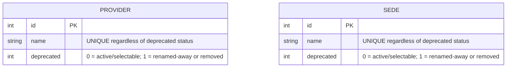
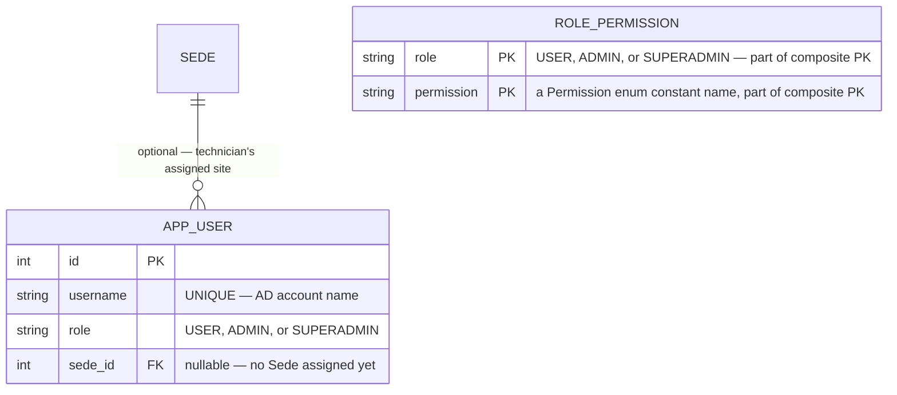
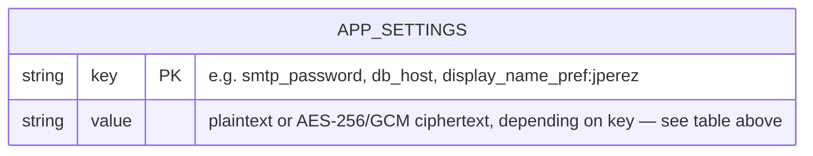

## Database Schema (ERD)

The local SQLite database lives at `data/noteapp.db` (created at first run). The schema mirrors the SQL Server structure `RemoteDatabaseService.ensureSchema()` creates on a remote database — same table names and column types, differing only where each dialect requires it. See `desktop-app/database/sqlserver/` for ready-to-run SQL Server schema and starting-data scripts, and that folder's `README.md` for a full remote-server setup walkthrough.

#### Equipment catalog tables

```mermaid

erDiagram
    direction TB

    TYPE ||--o{ BRAND_TYPE_LINK : ""
    BRAND ||--o{ BRAND_TYPE_LINK : ""
    BRAND_TYPE_LINK |o--o{ MODEL : "optional — NULL for the single global generic model"
    
    MODEL ||--o| SN_VALIDATION : ""
    BRAND_TYPE_LINK ||--o{ MODEL_STOCK : ""
    MODEL ||--o{ MODEL_STOCK : ""
    
    TYPE {
        int id PK
        string name "UNIQUE regardless of deprecated status — see Notes below"
        int is_asset "1 = asset (S/N + A/F); 0 = countable (quantity)"
        int requires_serial "1 = S/N mandatory, 'Sin S/N' checkbox disabled in ItemDialogView"
        int deprecated "0 = active/selectable; 1 = renamed-away or removed, kept for historical NOTE_ITEM FKs"
    }

    BRAND {
        int id PK
        string name "UNIQUE regardless of deprecated status; 'Genérico / Otro' is protected from deletion"
        int deprecated "0 = active/selectable; 1 = renamed-away or removed"
    }

    BRAND_TYPE_LINK {
        int id PK
        int type_id FK
        int brand_id FK
        "UNIQUE(type_id, brand_id)"
    }

    MODEL {
        int id PK
        int brand_type_id FK "nullable — NULL marks the single global 'Genérico / Otro' model, not scoped to any link"
        string name "UNIQUE(brand_type_id, name) regardless of deprecated status — same name OK under a different brand/type; UNIQUE(name) WHERE brand_type_id IS NULL for the global row"
        int deprecated "0 = active/selectable; 1 = renamed-away or removed"
    }

    SN_VALIDATION {
        int id PK
        int model_id FK
        string regex_pattern "optional; expected length and the 'Patrón esperado' hint shown in ItemDialogView are always derived from this at display time, never stored separately"
        int is_active "1 = enforce; 0 = skip"
    }

    MODEL_STOCK {
        int brand_type_id PK_FK "part of composite PK, with model_id"
        int model_id PK_FK "part of composite PK, with brand_type_id"
        int stock "current quantity on hand for this (Type,Brand) usage of this model"
    }
```

`MODEL_STOCK`'s composite PK `(brand_type_id, model_id)` is not just the global-generic model's
own `brand_type_id` mirrored — for a normal (non-generic) model, `brand_type_id` here is
redundantly the same value the model's own `MODEL.brand_type_id` row already carries (one natural
row). The table exists specifically so the single global `MODEL` row (`brand_type_id IS NULL`)
can carry an independent stock number per (Type,Brand) it's actually used under, which a plain
`MODEL.stock` column couldn't express.

#### Provider table

Independent of the equipment catalog above — no FK relationship, just a flat, admin-managed list backing Nota de Proveedor's "PROVEEDOR" dropdown (`IEquipmentService.getAllProviders()`/`addProvider()`/`renameProvider()`/`removeProvider()`). Added 2026-07-10 to fix the dropdown, which was previously unpopulated and non-functional.



---

#### User role, Sede assignment, and permission grant tables

Added 2026-07-24 alongside the login screen (as `USER_ROLE`, `ADMIN`/`USER` only, no Sede
assignment); renamed `APP_USER` and extended with `sede_id` and a `SUPERADMIN` tier on 2026-07-30
as part of a "prohibit-all, allow per role" RBAC redesign (see `CLAUDE.md`'s
"Role-based permissions (RBAC)" section for the full design discussion). `USER` on its own is a
reserved keyword/niladic function in T-SQL, hence `APP_USER` rather than a literal rename.

`APP_USER` is unrelated to AD group membership (which gates app access at login, checked live
against the AD API, never stored locally) — it only distinguishes role/Sede among accounts that
already passed that gate. `IUserRoleService.getRole()` defaults to `"USER"` when a username has no
row; `getSedeId()` returns `null` when unassigned. `ROLE_PERMISSION` is the deny-by-default
permission grant table — a `Permission` (a compile-time Java enum, not itself a DB table) is
denied to a role unless a matching row exists here. Neither table has any in-app write UI — a
superadmin manages both with plain SQL `INSERT`/`UPDATE`/`DELETE` directly, mirroring how every
other admin-curated catalog in this app (`SEDE`, `PROVIDER`, etc.) is edited through the app's own
UI but these two deliberately are not, since role/permission changes are rare and high-consequence
enough to warrant direct DBA-style control instead.



A plain `ADMIN`'s Sede-scoped actions (approve/reject a note, sync GLPI, validate a Préstamo/
Provider return) are further restricted to notes whose own `NOTE_REPORT.sede_id` matches this
account's `sede_id` — enforced in application code (`AdminSession.hasPermission(Permission,
Integer)`), not by a DB constraint, since it's a business rule about which rows an action may
target, not a structural property of the schema. `SUPERADMIN` bypasses this scoping entirely.

---

#### Note history tables

```mermaid

erDiagram
    direction LR

    NOTE_REPORT ||--|{ NOTE_ITEM : ""

    NOTE_REPORT ||--o| NOTE_ENTREGA_DEVOLUCION : ""
    NOTE_REPORT ||--o| NOTE_PROVEEDOR : ""
    NOTE_REPORT ||--o| NOTE_REPORT_REJECTION : "row exists only for a rejected note"

    NOTE_ENTREGA_DEVOLUCION ||--o| NOTE_DEVOLUCION_FALLA : "row exists only for Devolucion+Falla"
    NOTE_ENTREGA_DEVOLUCION ||--o| NOTE_PRESTAMO_AREA_EVENTO : "row exists only when Prestamo captured one"

    NOTE_ITEM ||--o| NOTE_ITEM_ASSET : ""
    NOTE_ITEM ||--o| NOTE_ITEM_COUNTABLE : ""
    NOTE_ITEM ||--o| NOTE_ITEM_GLPI_TRACKING : ""
    NOTE_ITEM ||--o| NOTE_ITEM_RETURN_TRACKING : ""

    TYPE ||--o{ NOTE_ITEM : ""
    BRAND ||--o{ NOTE_ITEM : ""
    MODEL ||--o{ NOTE_ITEM : ""
    PROVIDER ||--o{ NOTE_PROVEEDOR : ""
    SEDE |o--o{ NOTE_REPORT : "optional — NULL only for notes predating this feature"
    
    NOTE_REPORT {
        int id PK
        datetime created_at "DATETIME2 on SQL Server (2026-07-29); ISO-8601 TEXT on SQLite (SqliteHistoryService reads both formats)"
        string profile_type "ENTREGA / DEVOLUCION / FIN_DE_CONTRATO / PROVEEDOR"
        string technician_name "plain text, snapshot at generation time"
        string technician_dni "plain text, snapshot at generation time"
        int sede_id FK "nullable — resolves to SEDE.name at read time via JOIN, same pattern as provider_id"
        string approval_status "PENDING (default) / APPROVED / RECHAZADO — added 2026-07-29, see Notes below"
    }

    NOTE_REPORT_REJECTION {
        int note_report_id PK_FK "row exists only for a rejected note — added 2026-07-30, see Notes below"
        string rejection_reason "NOT NULL — always populated when the row exists"
    }

    NOTE_ENTREGA_DEVOLUCION {
        int note_report_id PK_FK
        string user_name
        string user_dni
        string user_email
        string motivo "mandatory for ENTREGA; tentative return date (dd/MM/yyyy) for PRESTAMO"
    }

    NOTE_DEVOLUCION_FALLA {
        int note_report_id PK_FK "row exists only for a Devolucion note whose Motivo triggered the Falla popup — added 2026-07-30"
        string failure_cause "NOT NULL"
        string failure_details "optional"
    }

    NOTE_PRESTAMO_AREA_EVENTO {
        int note_report_id PK_FK "row exists only when a Prestamo note actually captured one (itself optional) — added 2026-07-30"
        string area_evento "NOT NULL — always populated when the row exists"
    }

    NOTE_PROVEEDOR {
        int note_report_id PK_FK
        int provider_id FK "references PROVIDER(id), possibly a deprecated/renamed-away row — see Notes below"
        string cuit
        string motivo "mandatory"
    }

    NOTE_ITEM {
        int id PK
        int note_id FK
        int type_id FK "references TYPE(id), possibly a deprecated/renamed-away row — see Notes below"
        int brand_id FK "references BRAND(id), possibly a deprecated/renamed-away row"
        int model_id FK "references MODEL(id), possibly a deprecated/renamed-away row"
        string observations
    }

    NOTE_ITEM_ASSET {
        int item_id PK_FK "row exists only for asset items"
        string serial_number
        string a_f
    }

    NOTE_ITEM_COUNTABLE {
        int item_id PK_FK "row exists only for countable items"
        int quantity "default 1"
    }

    NOTE_ITEM_GLPI_TRACKING {
        int item_id PK_FK "row exists only when GLPI-tracked (asset AND not Prestamo) — absence IS 'N_A' now"
        string status "PENDING | SYNCED | REJECTED"
        string rejection_reason "null unless REJECTED"
        datetime status_updated_at "DATETIME2 on SQL Server (2026-07-29); ISO-8601 TEXT on SQLite; null until first sync attempt"
    }

    NOTE_ITEM_RETURN_TRACKING {
        int item_id PK_FK "row exists only when the note is a Prestamo — absence IS 'N_A' now"
        string status "PENDING | RETURNED | LOST"
        string rejection_reason "null unless LOST"
        datetime status_updated_at "DATETIME2 on SQL Server (2026-07-29); ISO-8601 TEXT on SQLite; null until first return action"
    }
```

**`NOTE_ITEM` normalized into 5 tables (2026-07-22)** — the previous single wide table (`is_asset`, `serial_number`/`a_f` vs `quantity`, the `glpi_*`/`return_*` tracking triples) always had one whole tracking dimension and one of asset-vs-countable sitting at a dead `NULL`/`'N_A'` value depending on the item's type and the note's profile. Split above so a subtype row only ever exists when that dimension actually applies. `NoteReportItem.java`, the `GlpiStatus`/`ReturnStatus` enums, and every controller/template are unaffected — only `SqliteHistoryService`'s SQL changed (see `CLAUDE.md`'s "SQLite tables" section for the full migration mechanics, on both SQLite and SQL Server).

**Catalog-FK redesign (2026-07-22, same day)** — `NOTE_ITEM.type_name`/`brand_name`/`model_name` and `NOTE_PROVEEDOR.provider_name` (plain text snapshots) were replaced with real `type_id`/`brand_id`/`model_id`/`provider_id` foreign keys into the catalog. `TYPE`, `BRAND`, `MODEL`, and `PROVIDER` each gained a `deprecated` column: renaming or removing a row never mutates or deletes it — it's marked `deprecated = 1` and a new (or reactivated, if a matching deprecated row already exists) `deprecated = 0` row takes over the name, so a historical note's FK still resolves to a row carrying its exact original name. Uniqueness on `name` (and, for `MODEL`, `(brand_type_id, name)`) is enforced regardless of `deprecated` status — a given name lives on exactly one row at a time. Renaming a `TYPE`/`BRAND` cascades: every `BRAND_TYPE_LINK` that used the old id gets an equivalent link under the new id, with every active `MODEL` under it cloned forward, so the active catalog never silently loses children. See `CLAUDE.md`'s catalog-FK redesign section for the full backfill/migration mechanics (both SQLite and SQL Server) and `SqliteEquipmentService.java` for the rename/cascade logic.

**`NOTE_ENTREGA_DEVOLUCION`/`NOTE_REPORT` split further (2026-07-30)** — a fresh schema-normalization audit found the same "doesn't apply to this row" pattern the `NOTE_ITEM` split above already fixed: `failure_cause`/`failure_details` (Devolución+Falla only) and `area_evento` (Préstamo-only, and optional even there) were nullable columns shared across all 4 profile types `NOTE_ENTREGA_DEVOLUCION` serves; `NOTE_REPORT.rejection_reason` (added 2026-07-29) was nullable unless `approval_status = 'RECHAZADO'`. Split into `NOTE_DEVOLUCION_FALLA`, `NOTE_PRESTAMO_AREA_EVENTO`, and `NOTE_REPORT_REJECTION` above — each a row-exists-only-when-applicable subtype table, same shape as `NOTE_ITEM_GLPI_TRACKING`/`NOTE_ITEM_RETURN_TRACKING`. No table-rebuild needed for either engine (none of the 4 retired columns were referenced by FK) — a plain backfill + native `DROP COLUMN` on both SQLite (3.35+) and SQL Server. See `CLAUDE.md`'s "NOTE_ENTREGA_DEVOLUCION and NOTE_REPORT normalized further" section for the full migration mechanics.

---

#### Settings table

| Key | Value | Description |
|-----|-------|-------------|
| `smtp_password` | Base64-encoded AES-256/GCM ciphertext | SMTP password, encrypted via `AppKeyEncryptionService` |
| `glpi_api_key` | Base64-encoded AES-256/GCM ciphertext | GLPI REST API key, encrypted via `AppKeyEncryptionService` |
| `ad_api_token` | Base64-encoded AES-256/GCM ciphertext | AD API bearer token, encrypted via `AppKeyEncryptionService` |
| `db_username` | Base64-encoded AES-256/GCM ciphertext | Remote DB username, encrypted via `AppKeyEncryptionService` |
| `db_password` | Base64-encoded AES-256/GCM ciphertext | Remote DB password, encrypted via `AppKeyEncryptionService` |
| `display_name_pref:<username>` | Plaintext | Technician's personal greeting-name preference for the sidebar welcome message, one row per technician username. Set via `TechnicianSessionService.setDisplayNamePreference()`, `ProfileController`'s "NOMBRE PARA MOSTRAR" field. Not a secret — stored unencrypted, unlike the rows above. |
| ~~`sede_pref:<username>`~~ | — | **Removed 2026-07-30.** Sede is no longer a self-service preference — it's read from the superadmin-assigned `APP_USER.sede_id` (see the "User role, Sede assignment, and permission grant tables" section above) instead. A pre-2026-07-30 install may still have stray rows under this key; nothing reads them anymore. |

`smtp_password`, `glpi_api_key`, `db_password`, and `ad_api_token` can ship pre-configured: `app-config.json`'s `defaults` object holds pre-encrypted values that `ServiceLocator.provisionDefaultSecrets()` copies into this table on first startup, only if that key isn't already set (see README.md's "Pre-configuring default secrets").



Schema-less key-value table — see the table above for the actual keys in use; this diagram shows only its two columns, not its rows.

---

#### Notes

- `'Genérico / Otro'` brand row (renamed from `'Generic'` 2026-07-22) is inserted on first run and is protected from deletion in `SqliteEquipmentService`. `MODEL` has its own single global `'Genérico / Otro'` row too (`brand_type_id IS NULL`, added 2026-07-23) — offered for every brand+type combination regardless of whether a real `BRAND_TYPE_LINK` exists, via a `UNION` in `getModelsForBrandAndType()`. This replaced an earlier per-`BRAND_TYPE_LINK` duplicate (one "Genérico / Otro" `MODEL` row per link, forced by `brand_type_id` being `NOT NULL`) — a real redundancy, since the label never actually varied by scope; renaming it meant updating N rows to stay in sync. `removeModel()` refuses to delete this row (it can only be renamed); `idx_model_global_generic_name` (`UNIQUE(name) WHERE brand_type_id IS NULL`) and `idx_model_single_active_generic` (`UNIQUE(deprecated) WHERE brand_type_id IS NULL AND deprecated = 0`) back it at the DB level — a plain `UNIQUE(brand_type_id, name)` can't, since every SQL engine treats NULL as never-equal-to-NULL even inside a unique index. The seed label is configurable via `app-config.json`'s `catalog.genericLabel` (one-shot: only used the first time the row is created — renaming it afterward is a normal admin catalog rename, same as any Brand/Model, so historical notes keep showing whatever label was active when they were generated).
- `NOTE_ENTREGA_DEVOLUCION` and `NOTE_PROVEEDOR` are optional one-to-one extensions of `NOTE_REPORT`, populated based on `profile_type`.
- `NOTE_REPORT.technician_name`/`technician_dni` store the generating technician's identity as a plain-text snapshot at generation time — the technician's identity is session-only, sourced from Windows/AD, and never persisted elsewhere (see `TechnicianSessionService` in `docs/architecture.md`). The `TECHNICIAN_PROFILE` table and `NOTE_REPORT.technician_id` FK that predated this snapshot approach were removed entirely (2026-07-16); any note created before that change that only had `technician_id` set now shows a blank author in History.
- All encrypted values use `AppKeyEncryptionService` (AES-256/GCM, replaced Windows DPAPI on 2026-07-08) — a single fixed key shared across every installation, chosen specifically so these organization-wide shared credentials can be pre-configured across many machines without per-account/per-machine setup. See `CLAUDE.md`'s Known issues/gotchas for the accepted security trade-off.
- `NOTE_ITEM.glpi_status` tracks GLPI sync state per asset item. Only rows where `is_asset = 1` are eligible for GLPI sync; countable items always remain `N_A`. `NoteReport` aggregates these counts into `getPendingItemCount()`, `getSyncedItemCount()`, `getRejectedItemCount()` for display in the history table.
- `GlpiStatus` enum values: `N_A` (no GLPI tracking), `PENDING` (queued for sync), `SYNCED` (successfully pushed to GLPI), `REJECTED` (sync attempted but rejected, reason stored in `glpi_rejection_reason`).
- `NOTE_ITEM.return_status` (added 2026-07-17, Préstamos section) is a separate dimension from `glpi_status` — it tracks whether a *loaned* item has come back, for both asset and countable items (unlike GLPI, which is asset-only). Only set to `PENDING` at insert time for `NOTE_REPORT.profile_type = 'PRÉSTAMO'` notes and (added 2026-07-29) Provider notes whose Motivo is in the config-driven `AppConfig.returnableMotivosProveedor` list; every other note type's items stay `N_A`. `ReturnStatus` enum values: `N_A`, `PENDING` (awaiting return), `RETURNED` (confirmed back), `LOST` (reason stored in `return_rejection_reason`). `NoteReport` aggregates these into `getReturnPendingItemCount()`/`getReturnedItemCount()`/`getLostItemCount()` for the Préstamos Historial table (`PrestamoHistoryController`) — see `CLAUDE.md`'s "Préstamos section" for the full flow.
- `NOTE_REPORT.approval_status` (added 2026-07-29) gates whether a note's item-level GLPI/return-tracking actions are reachable at all — every new note starts `PENDING`, and `NoteDetailController`/`PrestamoDetailController` render no item-level action rows until an admin approves it (`APPROVED`) or rejects it (`RECHAZADO`, mandatory `rejection_reason`, note treated as void). History's default filtered view shows `PENDING`+`APPROVED` only; a checkbox reveals `RECHAZADO` too. See `CLAUDE.md`'s "Note approval workflow" section for the full flow.
