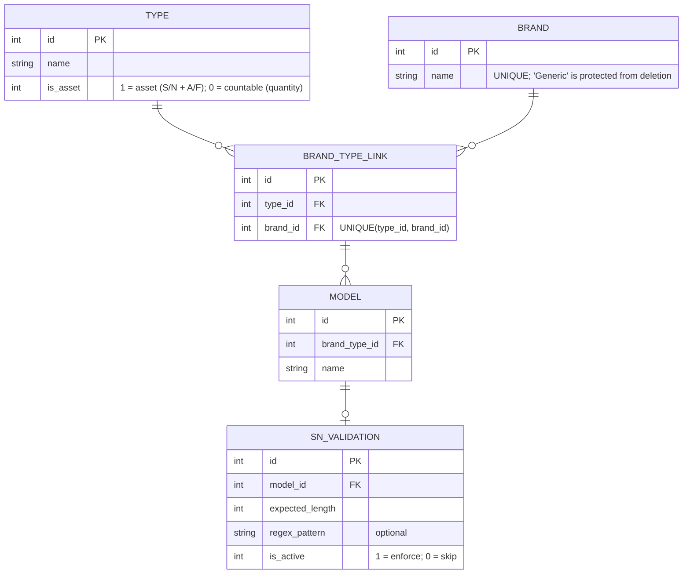

## Database Schema (ERD)

The local SQLite database lives at `data/noteapp.db` (created at first run). The schema mirrors the planned PostgreSQL structure so migrating requires only a JDBC driver swap and connection string change.

#### Equipment catalog tables



---

#### Note history tables

```mermaid

erDiagram
    direction LR

    NOTE_REPORT ||--|{ NOTE_ITEM : ""
    NOTE_REPORT }o--|| TECHNICIAN_PROFILE : "generated by"

    NOTE_REPORT ||--o| NOTE_ENTREGA_DEVOLUCION : ""
    NOTE_REPORT ||--o| NOTE_PROVEEDOR : ""
    
    NOTE_REPORT {
        int id PK
        string created_at "ISO-8601 timestamp"
        string profile_type "ENTREGA / DEVOLUCION / FIN_DE_CONTRATO / PROVEEDOR"
        int glpi_synced "0 = not synced"
        int technician_id FK
    }

    NOTE_ENTREGA_DEVOLUCION {
        int note_report_id PK_FK
        string user_name
        string user_dni
        string user_email
        string motivo "mandatory for ENTREGA"
    }

    NOTE_PROVEEDOR {
        int note_report_id PK_FK
        string provider_name
        string cuit
        string motivo "mandatory"
    }

    NOTE_ITEM {
        int id PK
        int note_id FK
        string type_name
        string brand_name
        string model_name
        string serial_number "null for countable items"
        string a_f "null for countable items"
        int quantity "default 1"
        string observations
        int is_asset "1 = asset (tracked in GLPI); 0 = countable"
        string glpi_status "N_A | PENDING | SYNCED | REJECTED; default N_A"
        string glpi_rejection_reason "null unless REJECTED"
        string glpi_status_updated_at "ISO-8601 timestamp; null until first sync attempt"
    }

    TECHNICIAN_PROFILE {
        int id PK
        string windows_username "UNIQUE; from System.getProperty(user.name)"
        string name
        string dni
        string email
    }
```

---

#### Settings table

| Key | Value | Description |
|-----|-------|-------------|
| `smtp_password` | Base64-encoded DPAPI ciphertext | SMTP password, encrypted via Windows DPAPI |
| `glpi_api_key` | Base64-encoded DPAPI ciphertext | GLPI REST API key, encrypted via Windows DPAPI |
| `ad_api_token` | Base64-encoded DPAPI ciphertext | AD API bearer token, encrypted via Windows DPAPI |

```sql
APP_SETTINGS (
    key   TEXT PRIMARY KEY,
    value TEXT
)
```

---

#### Notes

- `Generic` brand row is inserted on first run and is protected from deletion in `SqliteEquipmentService`.
- `NOTE_ENTREGA_DEVOLUCION` and `NOTE_PROVEEDOR` are optional one-to-one extensions of `NOTE_REPORT`, populated based on `profile_type`.
- `TECHNICIAN_PROFILE` is keyed by `windows_username` so each Windows account on the machine has its own profile.
- All encrypted values use Windows DPAPI via `WindowsDPAPIService` — decryption fails on a different Windows user account by design.
- `NOTE_ITEM.glpi_status` tracks GLPI sync state per asset item. Only rows where `is_asset = 1` are eligible for GLPI sync; countable items always remain `N_A`. `NoteReport` aggregates these counts into `getPendingItemCount()`, `getSyncedItemCount()`, `getRejectedItemCount()` for display in the history table.
- `GlpiStatus` enum values: `N_A` (no GLPI tracking), `PENDING` (queued for sync), `SYNCED` (successfully pushed to GLPI), `REJECTED` (sync attempted but rejected, reason stored in `glpi_rejection_reason`).
